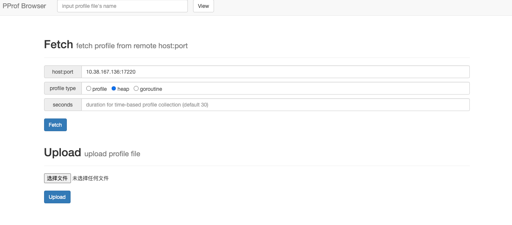
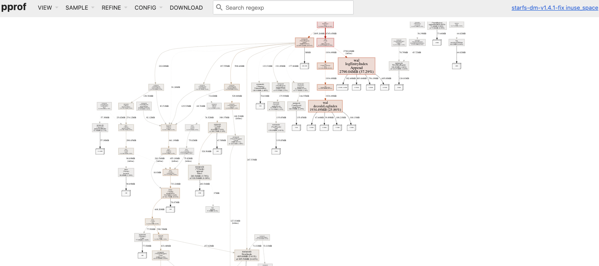

# Golang PProf Web Browser

## Features
1. **fetch** or **upload** golang profile file and store it. 
2. **analyse** profile file by golang pprof.
3. **share** pprof results url to others by link.


## Quick Start

``` 
# build 
> $ make
> $ cd build

# cmd help
> $ ./pprof-browser --help                        
Usage of ./pprof-browser:
  -dir string
    	files dir
  -f	run foreground
  -p string
    	port (default "8888")
    	

# start pprof-browser in background, with default port 8888
> $ ./pprof-browser

```

# Demo

## 1. fetch profle


## 2. profile result


## 3. share pprof result to others
```
# copy result link and share it
http://127.0.0.1:8888/view/20230307-104849-10.38.167.136:17220-heap/
```